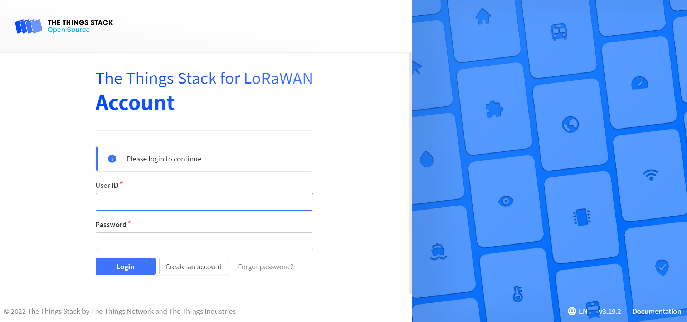
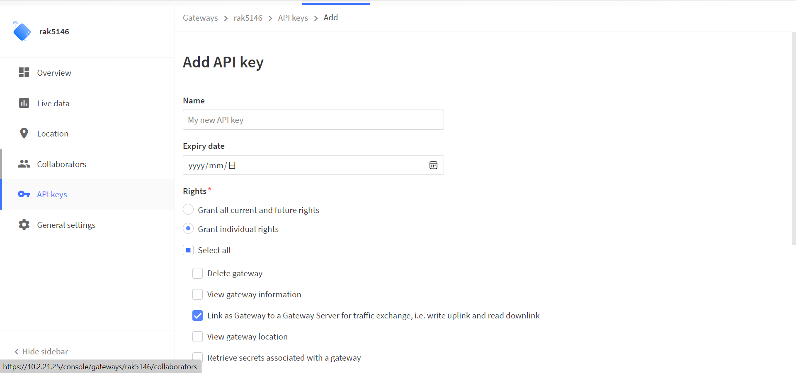
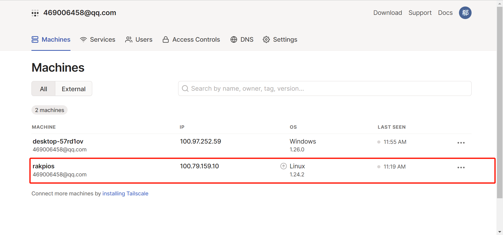

# Deploy dual band LoRaWAN gateway on the RAK7391

[TOC]

## 1. Introduction

This project deploy dual band(EU 868Hz and 2.4GHz) LoRa gateway with remote management using [Tailscale](https://tailscale.com/) on the RAK7391 and it also can show LoRaWAN statistics on an OLED screen. 


## 2. Hardware Setup

In this project, you need the following hardware:

- [RAK5146 WisLink LPWAN Concentrator](https://docs.rakwireless.com/Product-Categories/WisLink/RAK5146/Datasheet/)
- LoRa 2.4GHz Concentrator
- [RAK1921 WisBlock OLED Display](https://docs.rakwireless.com/Product-Categories/WisBlock/RAK1921/Overview/#product-description)
- RAK7391 WisGate Developer Connect

There are there MiniPCIe slots on the RAK7391, mount the RAK5146 Concentrator on the `MiniPCIe #1`  and mount 2.4GHz Concentrator on the `MiniPCIe #2`. The RAK7391 board has a dedicated I2C port (J14) for OLED screen, and RAK1901 can be assembled.


## 3. Software Deploy 

All services are placed separately in different folders and can be deployed with docker-compose. you need to deploy them in the following order:

### 3.1 Network Server

#### 3.1.1 Deploy TTS

In the `network-server` folder, you can deploy The Things Stack LoRaWAN Network Server on the RAK7391. First of all, you need to modify the  environment variable `TTS_DOMAIN` in the [docker-compose.yml](network-server/docker-compose.yml). It's value should be set to your host IP or DOMAIN. Then run the command *`docker-compose up`* to start up TTS service.

After the TTS is deployed successfully, you can visit the TTS console in your browser by the URL *https://{TTS_DOMAIN}* , the default User ID is `admin` and password is `changeme`.

 


### 3.1.2 Register gateway, app and device

There is an easy way to register gateway, app and device to TTS by the script tool [auto_lns_config.sh](network-server/auto_lns_config.sh). First, modify the configuration file [config.json](network-server/config.json) to match your gateway, app and device. 

To set the `frequency-plan-id`  filed for the gateway and device, you can run the following command to list all available frequency plans for gateway and device:

```
docker exec -it stack ttn-lw-cli gateways list-frequency-plans
docker exec -it stack ttn-lw-cli end-devices list-frequency-plans
```

Then run the following command to register gateway, app and device:

```
./auto_lns_config.sh ./config.json
```


### 3.2 Gateway

In the `gateway` folder, you can deploy Basicstaion and UDP package forwarder with docker-compose. Basicstation is connected to RAK5146 concentrator and UDP package forwarder is connected to 2.4GHz concentrator. You still need to modify the [docker-compose.xml](gateway/docker-compose.yml) file

#### 3.2.1 Basicstation

You need to modify the environment variable `TC_KEY`  and `TC_TRUST`  to match your TTS, then basicstation can connect to TTS successfully.

##### TC_KEY

You can get `TC_KEY` with the following steps:

- login to TTS console and Click **Go to Gateways** icon
- select the RAK5146 gateway 
- Under the gateway page, select the **API keys** menu on the left.
- Click **Add API key** button.
- Select Grant individual rights and then check these rights:
  - Link as Gateway to a Gateway Server for traffic exchange ...
- Click **Create API key**.
- Copy the created API key and paste this API key to the `TC_KEY` variable




##### TC_TRUST

You can run the following command to get `TC_TRUST` value:

```
docker exec -it stack ./get_certificate.sh
```

Then paste this certificate  to the `TC_TRUST` variable

#### 3.2.2 UDP package forwarder 


After you modify docker compose file, run the command *docker compose up* to start up basicstation and UDP package forwarder.


### 3.3 Package forwarder logger

To show LoRaWAN statistics on the OLED screen, we need to deploy [Packet Forwarder Loggers](https://github.com/xoseperez/packet-forwarder-loggers) to monitor metrics from Basicstation or UDP package forwarder.

In the [docker-compose.yml](packet-forwarder-loggers/docker-compose.yml) file, it monitor basicstation by default, if you want to monitor UDP package forwarder, you need to modify the environment variable `PROTOCOL` and `CONTAINER_NAME`. Then run the command *docker compose up* to start up the service.

After deploy the package forwarder logger, run the script [oled.py](oled.py)  by the follow command:

```
python3 oled.py
```

Then you can see the LoRaWAN statistics on the OLED screen.

### 3.4 Remote Access

In `the remote-access` folder, you can deploy [Tailscale](https://tailscale.com/) with docker-compose, then you can manage RAK7391 remotely. In the [docker-compose.yml](remote-access/docker-compose)，you need to modify the environment variable `TS_AUTH_KEY` generated by your Tailscale account. 

Here are the steps:

1. Browse to https://tailscale.com/, click the blue icon  `Use Tailscale` to login
2. Go to the setting page and generate the key.
3. Copy the key and paste this key to the `TS_AUTH_KEY` variable


Then run the command *docker compose up* to add RAK7391 to your own private Tailscale network. you can see the RAK7391 on the console:



Tailscale works seamlessly with Linux, Windows, macOS, Raspberry Pi, Android, Synology, and more. you can install Tailscale on your other device and log in with the same Tailscale account, then you can  manage RAK7391 remotely.