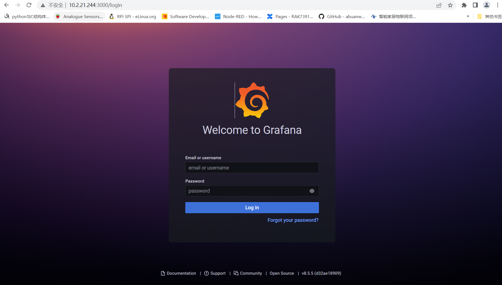
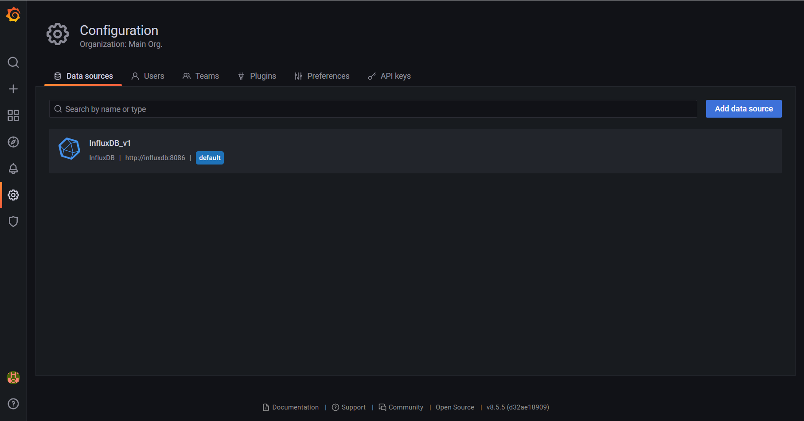
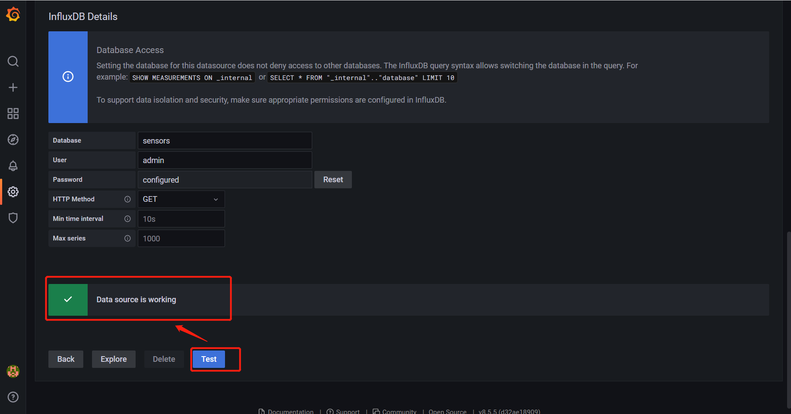

# InfluxDB DB and Grafana datasource

The goal here is to precreate a `sensors` database in InfluxDB  and preregister that same database in Grafana using the datasource provisioning file ([Provisioning](https://grafana.com/docs/grafana/latest/administration/provisioning/) ).

## 1. Run container

We have done the two works in docker compose file, so you only need to do `docker-compose up` in this directory.

The  `docker-compose.yml` file is shown as bellow:

```
version: '2'
services:
  influxdb:
    image: influxdb:1.8
    ports:
      - '8086:8086'
    networks:
      - bridge 
    volumes:
      - influxdb-storage:/var/lib/influxdb
    environment:
      - INFLUXDB_DB=sensors
      - INFLUXDB_HTTP_AUTH_ENABLED=true
      - INFLUXDB_ADMIN_USER=admin
      - INFLUXDB_ADMIN_PASSWORD=changeme
  grafana:
    image: grafana/grafana:latest
    ports:
      - '3000:3000'
    networks:
      - bridge 
    volumes:
      - grafana-storage:/var/lib/grafana
      - ./provisioning/:/etc/grafana/provisioning
    environment:
      - GF_SECURITY_ADMIN_USER=admin
      - GF_SECURITY_ADMIN_PASSWORD=changeme
volumes:
  influxdb-storage:
  grafana-storage:

networks:
  bridge:

```

There is a `provisioning/datasources/influxdb.yml` which we used to preregister a InfluxDB datasource in Grafana.

```
apiVersion: 1

datasources:
  - name: InfluxDB_v1
    type: influxdb
    access: proxy 
    database: sensors 
    orgId: 1
    user: admin
    url: http://influxdb:8086
    jsonData:
      httpMode: GET
    secureJsonData:
      password: changeme 
    version: 1
    editable: false
    isDefault: true

```


## 2. Test

After executing `docker-compose up`, we can input`http://<server-ip>:3000`  in browser to open Grafana pages.



The username and password are `admin` and `changeme`. When logged in, we can find there has already been a data source named  `InfluxDB_v1` in `Data Sources` page.



Click `test` button, we can find `Data source is working`.  




## 3. License

This project is licensed under MIT license.