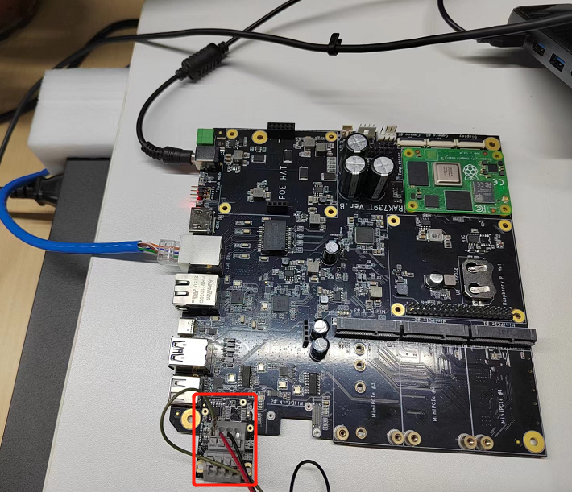
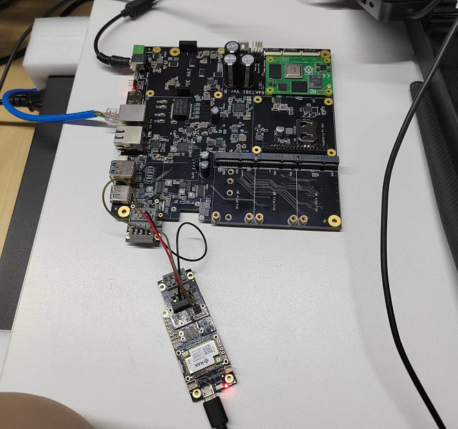
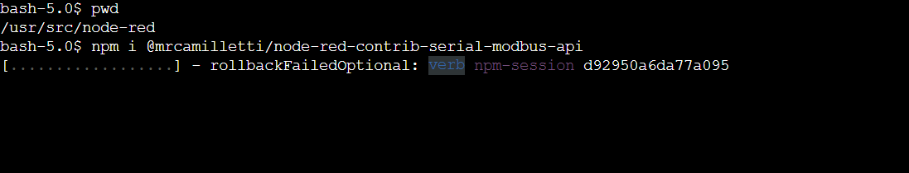
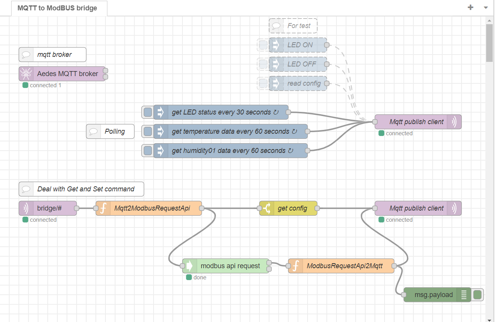
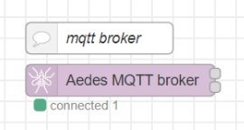
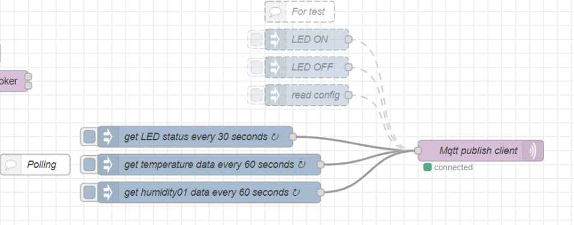
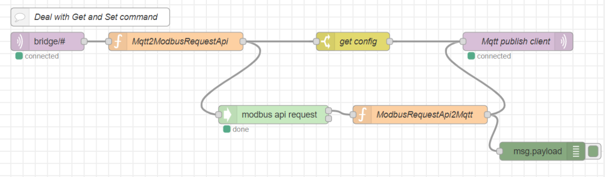
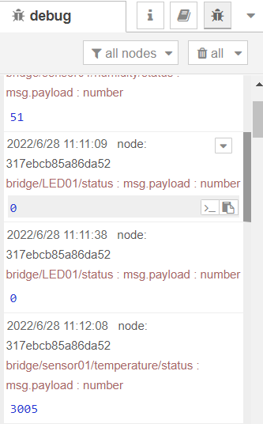

# MQTT to ModBUS bridge

[TOC]

## 1.Introduction

This guide explains use a NodeRED flow for a Modbus RTU (serial) to MQTT bidirectional bridge.

## 2. Preparation

### 2.1. Hardware

#### 2.1.1.  Master device

- RAK7391 WisGate Developer Connect + WisBlock IO RAK5802

In this example, we use a RAK7391 board to interface RAK5802. there are two WisBlock IO Connecter on the RAK7391 already, you can connect RAK5802 with any one of them.



#### 2.1.2. Slave Device

In this example we will first create a Modbus sensor (a.k.a. master or sender) using a WisBlock Starting Kit with a RAK1901 Temperature and Humidity Sensor and a RAK5802 IO Module.

- WisBlock Starter Kit (WisBlock Base RAK5005-O + WisBlock Core RAK4631) * 1


- RAK5802 * 1

  

- WisBlock Sensor RAK1901 * 1


#### 2.1.3. Connection diagram



### 2.3. Software

#### 2.3.1. Slave device

The code can be found under the [rak5802_modbus_device](rak5802_modbus_device/rak5802_modbus_device.ino) folder.  The example is 

You can open it directly with the Arduino IDE but you will first have to have it installed as well as the RAK6430 BSP. Check the [RAK4631 Quick Start Guide](https://docs.rakwireless.com/Product-Categories/WisBlock/RAK4631/Quickstart) to know more.

- [ArduinoIDE](https://www.arduino.cc/en/Main/Software)
- [RAK4630 BSP](https://github.com/RAKWireless/RAK-nRF52-Arduino)

At the top of the example sketch you have links to install the required libraries using the Arduino IDE Library Manager.

- [Arduino RS485 library](https://www.arduino.cc/en/Reference/ArduinoRS485)
- [ArduinoModbus library](https://www.arduino.cc/en/ArduinoModbus/ArduinoModbus)
- [Sparkfun SHTC3 Humidity and Temperature Sensor Library](https://github.com/sparkfun/SparkFun_SHTC3_Arduino_Library)

Then compile and upload the [sketch](rak5802_modbus_device/rak5802_modbus_device.ino).

#### 2.3.2. Master device

- **NodeRED container**

Create a docker compose file with the following content.

```
version: '3.7'

services:

  nodered:
    image: sheng2216/nodered-docker:1.1
    container_name: NodeRed
    user: node-red
    restart: unless-stopped
    devices:
      - "/dev/i2c-1:/dev/i2c-1"
      - "/dev/gpiochip0:/dev/gpiochip0"
      - "/dev/gpiomem:/dev/gpiomem"
      - "/dev/ttyUSB0:/dev/ttyUSB0"
      - "/dev/ttyUSB1:/dev/ttyUSB1"
    volumes:
      - 'node-red-data:/data'
    ports:
      - "1880:1880"

volumes:
  node-red-data:
```

Run `docker-compose up` at the same directory with docker compose file to start NodeRED container.

- **NodeRED node**

The client side is a node-red flow with [@mrcamilletti/node-red-contrib-serial-modbus-api](https://github.com/mrcamilletti/node-red-contrib-serial-modbus-api) module. You must install it before import this flow, run the following command in the root directory of your node-red install,  `/usr/src/node-red` for container. 

```
npm install @mrcamilletti/node-red-contrib-serial-modbus-api
```



We also need to install `node-red-contrib-aedes` as a mqtt broker.

```
npm install node-red-contrib-aedes
```

Please note that you must reboot the device after installing nodes.

## 3. Run example

### 3.1. Import flow and deploy

After all the preparation, you can import the [flow](./MQTT_to_ModBUS_bridge.json) now, the new flow should look like this:



There are three part in this flow:

- **MQTT broker**

Aedes MQTT broker is a internal mqtt broker in this flow.



- **Polling**



Polling section publish topics to get LED status, temperature data and humidity data.

- **Subscribe topic and deal with get/set commands**



This section subscribe mqtt topics and deal with get/set commands. For example,  set LED ON or OFF, get temperature or humidity data, get configuration.

After import and deploy the flow, we can find polling result at right side.



### 3.2. Use mqtt client to publish and subscribe topic

The topics the flow supports are as followings.

| **Topic**                                         | **Action**                          |
| :------------------------------------------------ | :---------------------------------- |
| `bridge/<device name>/<register name>/status`     | Polled value for the given register |
| `bridge/<device name>/<register name>/write`  XXX | Write value to the given registry   |
| `bridge/<device name>/<register name>/read`       | Force reading the given registry    |
| `bridge/config`                                   | Returns current configuration       |

The `<device name>` and `<register name>` are defined in configuration json object which is in `Mqtt2ModbusRequestApi` and `ModbusRequestApi2Mqtt` node of flow.

```
var config = {
  "devices": [
    {
        "id": 42, "name": "LED01",  "type": "coil", "address": 0, "quantity": 1
    },
    {
        "id": 42, "name": "sensor01", "type": "holding", 'quantity': 2,
        "registries": [
          { 'name': 'humidity', 'address': 0, 'polling': 60 },
          { 'name': 'temperature', 'address': 1, 'polling': 60 }
        ]
    }
  ]
}
```

We use `mosquitto_sub` and `mosquitto_pub` to subscribe and publish mqtt topic. Please install them before 

```
sudo apt install mosquitto-dev
sudo apt install mosquitto-clients
```

Then we can test mqtt topics.

For example, use the command bellow to control LED on. `172.23.0.2` should be replaced with the ip of nodered container.

```
mosquitto_pub -h 172.23.0.2 -t bridge/LED01/write -m 1
```

Use the command bellow to control LED off.

```
mosquitto_pub -h 172.23.0.2 -t bridge/LED01/write -m 0
```

And we can also subscribe topics. For example ,  use the command bellow to subscribe `temperature`.

```
mosquitto_sub -h 172.23.0.2 -t bridge/sensor01/temperature/status
```

Then you can receive the temperature data `60` seconds later. If you want receive it immediately, you can run `mosquitto_sub -h 172.23.0.2 -t bridge/sensor01/temperature/read -m ""` at another terminal.


## 4. License

This project is licensed under MIT license.
