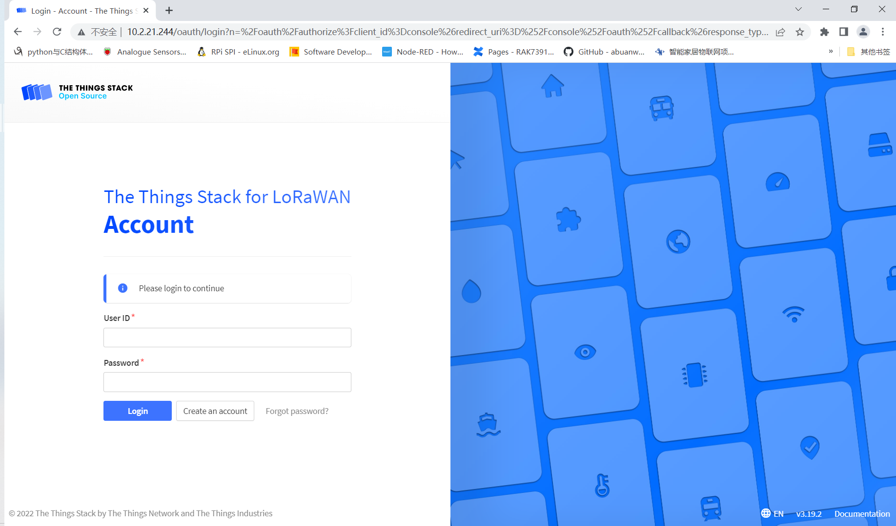
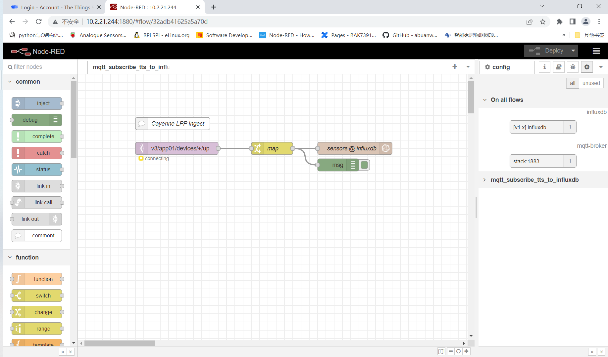
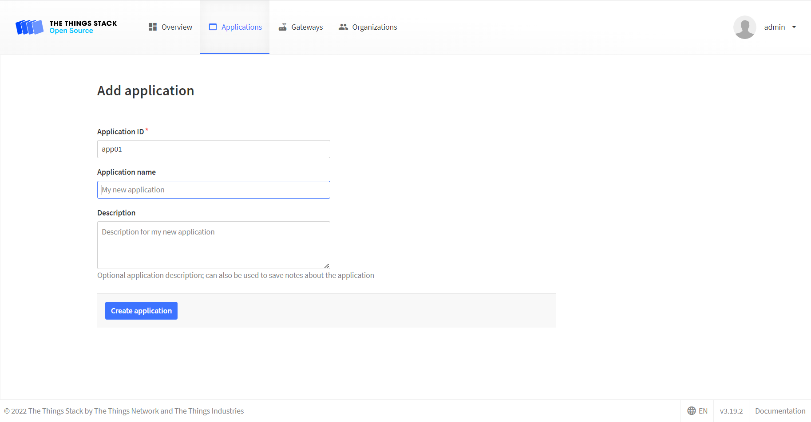

#  Default Node-RED flow

[TOC]

## 1. Introduction

This guide explains how to use MQTT to subscribe uplink messages from TTN stack. Once the messages from the registered devices arrive to the LNS, they are being published as MQTT messages so we can process them from Node-RED.

### 1.1. Docker compose

[Docker-compose](./docker-compose.yml) file here contains 6 services,  where `stack` is a TTN stack service which depends on `redis` and `postgres` service,  `node-red` service contains a default flow which subscribe uplink data from TTN stack by MQTT protocol and stores the data into influxdb database whose  name is sensors, `influxdb` service provide a database which `node-red` will use, and `grafana` service can use the influxdb as a data resource.

### 1.2. Url and account

Modify value of  `TTS_DOMAIN` environment variable of `stack` service in docker compose file to your device IP or domain.

Then do `docker-compose up`,  we can open `ttn`. The default User ID and Password is `admin` and `changeme`.

Open `node-red` which has a default flow.

Open `grafana`. The default Username and Password is `admin` and `changeme`. When loged in, there will be a default data resource. 

And we can also access `influxdb` container with the following commands.  Default username and password s `admin` and `changeme`. Then we will found there will be `sensors` databases.

 

## 2. Preparation

### 2.1 Create application

Select `Write downlink application traffic` and `Read application traffic (uplink and downlink)`at least. The two rights is needed by MQTT.

Copy the API key, we will use it on NodeRED flow. Please note that you must copy the key and store it some where. If not, you can not get it again, unless you create a new API keys and copy it.

## 3. Modify NodeRED flow

### 3.1 Modify mqtt-broker node

Open `mqtt-broker` node and paste the API keys we copied before to Password. The Username is the id of application we created before.

### 3.2 Modify influxdb node and Deploy

Open `influxdb` node and modify Username and Password.  If username is `admin` and Pasword is `changeme`, you  needn't to change it. 

### 3.3 Modify MQTT subscribe topic

The format of uplink data of ttn stack is `v3/{application_id}/devices/{device_id}/up`.  Here we user `+` to subscribe all devices under application `app01`. If you only want to subscribe one device, you can change `+` to the id of specific device.

### 3.4 Deploy

If all has been done, then click Deploy button, we will find status of mqtt client is `connected`.

## 4. Next works

Now, we have connected mqtt-broker and influxdb successfully.  There will be some works to do if we want do a complete example. 

- Next works are as bellow:
- Add gateways and end devices
- Set format of unplink data as CayenneLPP
- Deploy gateway with same eui on ttn stack
- Deploy devices  with same eui on ttn stack and its format of uplink data  is CayenneLPP 
- Visualize data from sensors database on grafana

## 5. License

This project is licensed under MIT license.
