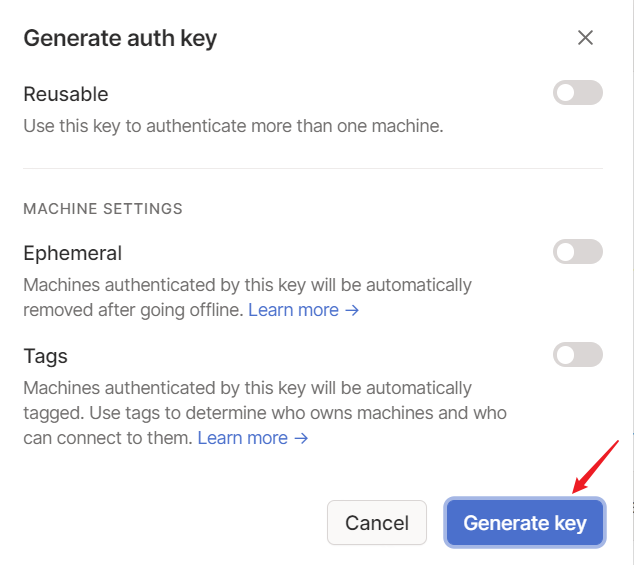
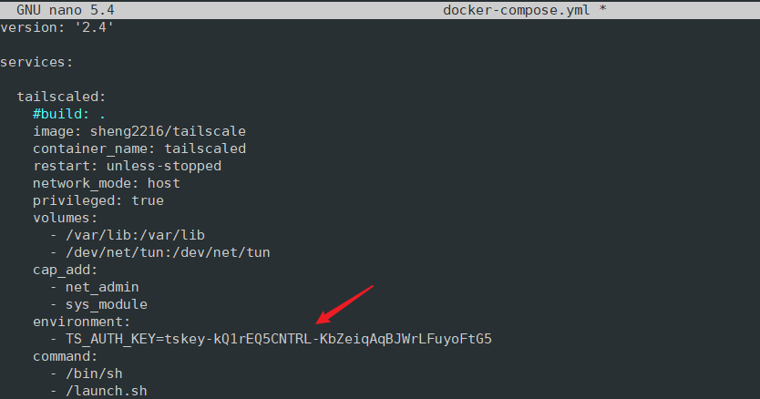

# Tailscale automatic login with anthkey

[TOC]

## 1. Introduction

This guide explains how to automate the login of the Tailscale with a docker-compose file.

### 1.1. Tailscale

[Tailscale](https://tailscale.com/) is a zero config VPN. It can be Installed on any device in minutes, it manages firewall rules for users, and works from anywhere. Tailscale create a secure network between your servers, computers, and cloud instances. Even when separated by firewalls or subnets, Tailscale just works.

### 1.2. containerized Tailscale 

The Tailscale image used in this guides is a modified image with a `launch.sh`  script that does the auto login job for you. The image is based on the latest official image, please check Tailscale's official [Dockerhub documentation](https://hub.docker.com/r/tailscale/tailscale) for more information. When using the official image, users need run the Tailscaled agent first, and then log in manually.


## 2. Preparation

### 2.1 authkey

In the docker-compose file, we defined an environment variable called `TS_AUTH_KEY`, this is the pre-authentication keys (“auth keys” for short), it allows you to register new nodes without needing to sign in via a web browser. 

While the authkey give you some conveniences when you register the node, you still need to create an account on Tailscale first, and then generate an anth key first, and then paste this key to the `docker-compose.yml` file.

Here are the steps；

1. Browse to https://tailscale.com/, click the blue icon  `Use Tailscale` to [create an account or login](https://login.tailscale.com/start ). 

2. After you create your account, you can learn how to install it. But since we are using the containerized Tailscale, we will do it in the container way, so just skip it.

   

3. Now we should go to the setting page and generate the key. There are different kinds of keys, check the [documentation](https://tailscale.com/kb/1085/auth-keys/) for information about each kind of key.

   

   

   

   4. Now you should be able to see the key, you need to copy the key, 

      

      and set it as an environment variable in the `docker-compose.yml` file:

      

   

### 2.2 Image

You can build the image by yourself, we provided a **Dockerfile** for you to play with; or just use the image provided by us. It's totally up to you. 

If you decided to build a new image, you can run the following command to build a image called `tailscale/mytailscale:latest`

```
docker build -t tailscale/mytailscale .
```

or forget about the **Dockerfile**, let `docker-compose.yml` to do the job for you:

```
version: '2.4'

services:
  tailscaled:
    build: .
    #image: sheng2216/tailscale  #you can change the image name to your own image name
    container_name: tailscaled
    restart: unless-stopped
    network_mode: host
    privileged: true
    volumes:
      - /var/lib:/var/lib
      - /dev/net/tun:/dev/net/tun
    cap_add:
      - net_admin
      - sys_module
    environment:
      - TS_AUTH_KEY=<change this to your own authkey>
    command:
      - /bin/sh
      - /launch.sh
```

### 2.3 docker-compose up

Now you have the authkey, you also have the image, it's time to bring up the container, just run the following command in the same directory with the `Dockerfile` and `docker-compose.yml` file:

```
docker-compose up
```

you should see that your mahcine is connected in the terminal:


and also connected in the console (Web interface):


Now, the IP assigned to this machine is 100.98.64.7, you can add register another node in the same way, and try to see if you can control each machine from the other machine using SSH.

## 3. Delete node

If you don't need this node anymore, you can just stop this container, and also release corresponding resources ( `docker-compose down` ). If you wan to change the authkey or you want to completely delete it, you need run the following command as `root` (not `sudo`) to destroying any state or local information：

```
su root
#enter you password
rm /var/lib/tailscale/tailscaled.state
```


## 4. License

This project is licensed under MIT license.
