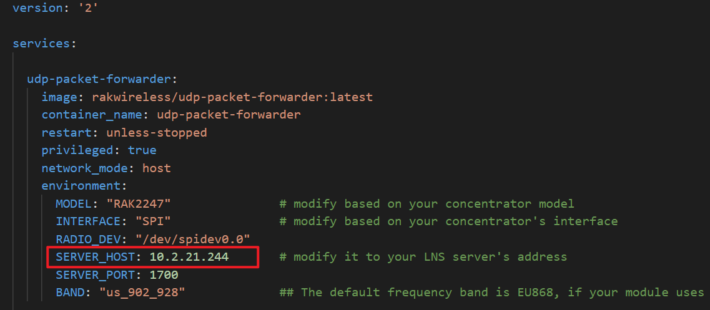
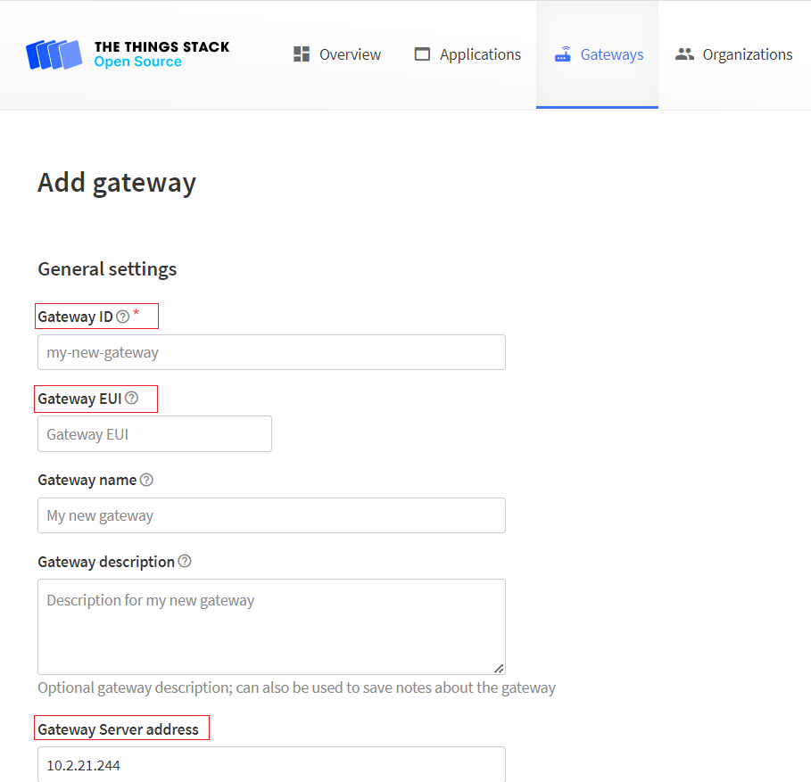
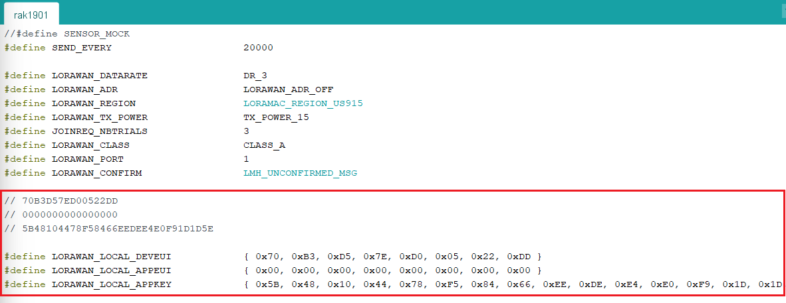
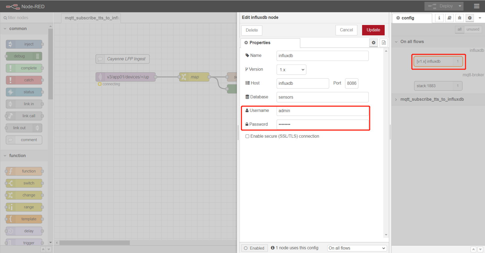
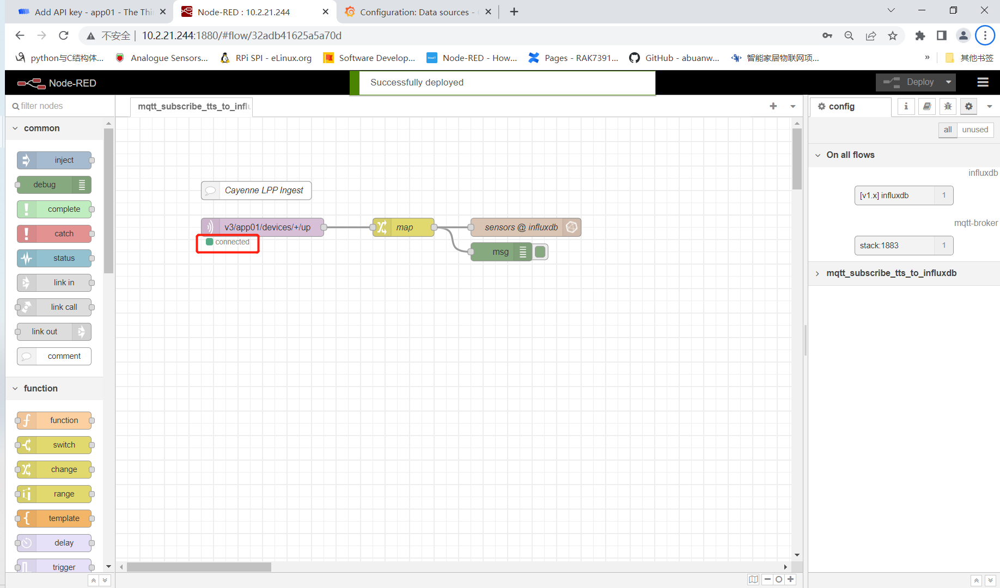
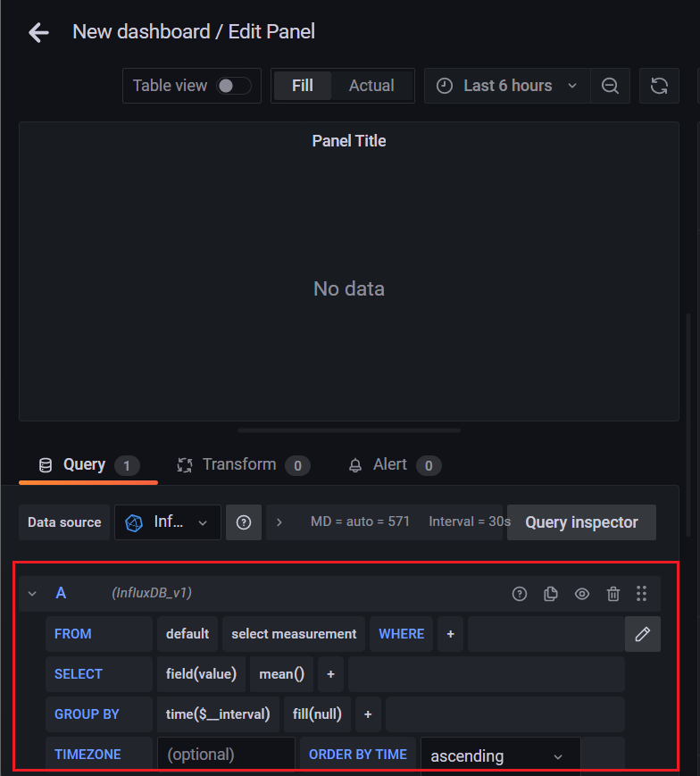

# Standalone LoraWAN Gateway 

[TOC]

## 1. Introduction

This guide explains how the Standalone LoraWAN Gateway works. We will use MQTT to subscribe uplink messages from TTN stack. Once the messages from the registered devices arrive to the LNS, they are being published as MQTT messages so we can process them from Node-RED. The environmental data is stored in the influxdb databases, and then visualized through Grafana.

### 1.1. Docker compose

We have 7 services defined in the [Docker-compose](./docker-compose.yml) file: 

- `udp-packet-forwarder` interacts with the LoRa chip to receive and transfer LoRa packets
- `stack` is a TTN stack service which depends on `redis` and `postgres` service, `stack`enables connectivity, management, and monitoring of devices, gateways and end-user applications
- `Redis` is the main data store for the Network Server, Application Server and Join Server, and it is also used by Identity Server and event system.
- `Postgres` is another databased used by `stack` 
- `node-red` service contains a default flow which subscribe uplink data from TTN stack by MQTT protocol and stores the data into a `influxdb` database, whose name is **sensors**; 
- `influxdb` service provide a database which `node-red` will use
- `grafana` service uses the influxdb as a data resource, and visualize the data.

### 1.2. Url and account

Modify the "SERVER_HOST" environment variables defined in the service `udp-packet-forwarder` , and also the `TTS_DOMAIN` environment variable of the `stack` service in docker compose file to your device IP or domain.




Then do `docker-compose up`,  we can browse to the Tings Stack's web interface, in this case, just enter 10.2.21.244 in your browser. The default User ID and Password is `admin` and `changeme`.


after you login, you need to create your a gateway first:


navigate to the web-interface of `node-red` , in this case, in the same LAN, go to [10.2.21.244:1880](10.2.21.244:1880), and you should be able to see the default flow. It's not ready to work for now, we will create an application in TTS first, and then come back and fill out some important information to make it work.


Open `grafana`, in this case [10.2.21.244:3000](10.2.21.244:3000) , The default Username and Password is `admin` and `changeme`. When loged in, there will be a default data resource. 


As a side note, we can also access `influxdb` container with the following commands.  The default username and password for the user in the influxdb container are `admin` and `changeme`. Then we will found there is a `sensors` databases.

 


## 2. Preparation

### 2.1 Create Gateway

You need to add your gateway to TTS first. Go to the **Gateway** configuration page, enter the general ID, Gateway EUI, Gateway server address, and also the frequency plan. If you use the default docker-compose file, your gateway EUI can be acquired by running the following command in your host:

```
docker exec -it udp-packet-forwarder ./get_eui.sh
```

The gateway server address is the one you defined in the docker-compose file. Make sure you choose the right frequency plan.



after the gateway is created in TTS, you should be able to see the gateway is online in the gateway detail page:


### 2.2 Create application

Now, as we mentioned above, we need to create an application in TTS. 


Select `Write downlink application traffic` and `Read application traffic (uplink and downlink)`at least. The two rights is needed by MQTT.


Copy the API key, we will use it on NodeRED flow. Please note that you must copy the key and store it somewhere safe. If you forget to save it, you won't be able to see it again, unless you create a new API keys and copy it.


### 2.3 Prepare end device

Now, the TTS side's configuration is about to finish, we need to add end-devices to the application so that we can start to receive uplink data sent by the end-devices on the gateway. But even before that, we need prepare the end device. The end device we used is a WisBlock kit with the RAK1901 sensor that reports temperature and humidity. You can find more details in RAKwireless's [official documentation](https://docs.rakwireless.com/Product-Categories/WisBlock/RAK1901/Quickstart/#software-configuration-and-example). The Arduino code [rak1901.ino](./rak1901.ino) is provided, you can copy paste the code, and then upload to the board. Make sure to change the device EUI, the App EUI, and the App key.



Now we need to go back to the TTS, under the application page, add your first end-device:


switch to manually mode, and then enter the following higlighted section, make sure the DevEUI, AppEUI, AppKey match what you defined in the Arduino code:


After the end-device is registered, you should be able to see the end-device is online, and also the uplink data sent from the end-device:


to make use of the CayenneLPP, you need to go to the end-device's page, and then in the **Payload formatters** page, switch the default ulplink formatter type to CayenneLPP:


now you should be able to see the converted live-data:


## 3. Modify NodeRED flow

### 3.1 Modify mqtt-broker node

Open `mqtt-broker` node and paste the API keys we saved before to the **Password**. The Username is the id of application we created before in TTS's application page.


### 3.2 Modify influxdb node and Deploy

Open `influxdb` node and modify Username and Password.  If username is `admin` and Pasword is `changeme`, you  needn't to change it. 



### 3.3 Modify MQTT subscribe topic

The format of uplink data of ttn stack is `v3/{application_id}/devices/{device_id}/up`.  Here we user `+` to subscribe all devices under application `app01`. If you only want to subscribe one device, you can change `+` to the id of specific device.


### 3.4 Deploy

If all has been done correctly, after you click Deploy button, you should be able to find status of mqtt client is `connected`:



and your 

## 4. Data visualization in Grafana

Now, the temperature and humidity data is monitoring by the end-devices, and the data is upload to the TTS and then saved to the influxdb databases. Now we are going to visulize the data.

Open Grafana's web interface and then create a new dasbboard:



the "measurement" will be something like "eui-xxxxxxxx", and you can **Select** either/both "temperature_1" or "relatively_humidity_2" to display. If you want to display temperature and relatively_humidity on the same panel, you can create another query. The final result should be somthing like the following graph:


## 5. License

This project is licensed under MIT license.
